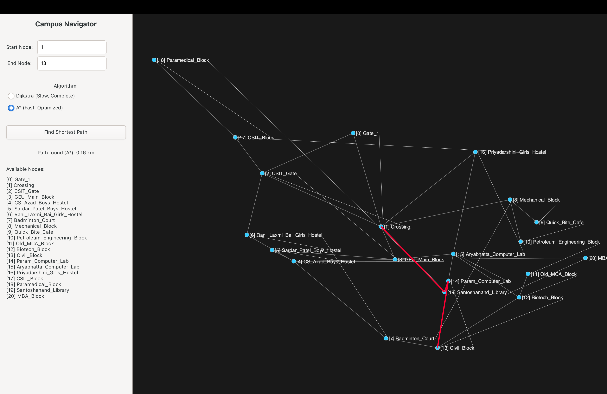
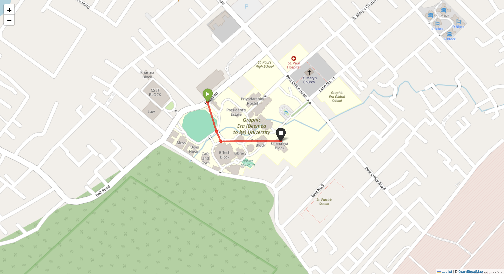

# Campus Navigation System 🗺️

This project is a **C-based graphical navigation application** that finds the shortest path between two points on a university campus map.

The system models the campus as a **graph data structure**, calculates real-world distances using the **Haversine formula**, and supports **Dijkstra's Algorithm** and **A* (A-star) Algorithm** for efficient pathfinding.

The application uses **GTK 4** and **Cairo graphics** to provide a modern, interactive visualization of the campus map and the computed navigation route.

---

# Features

## Visual Map Display
- Renders the campus map using **Cairo 2D graphics** inside a GTK 4 window.
- Displays nodes (locations) and edges (paths) visually.

## Correct Map Scaling
- Preserves the **real-world aspect ratio** of the campus map.
- Prevents distortion when resizing the window.

## Dual Pathfinding Algorithms

### Dijkstra's Algorithm
- Guarantees the shortest possible path.

### A* (A-star) Algorithm
- Uses a **Haversine distance heuristic** to guide the search.
- Provides faster pathfinding in large graphs.

## Interactive Controls
- Scrollable list of all campus nodes (locations).
- Text input for **start and destination nodes**.
- Shortest path highlighted in **red** on the map.
- Displays **total path distance in kilometers**.

## Data-Driven Design
Campus layout is loaded from a **simple `.txt` file** containing:

- Node coordinates (latitude & longitude)
- Node names
- Connections between nodes

---

# Screenshots

## Application Interface using Gtk


## Application Interface using Python and C


---

# Dependencies

To build and run this application you need:

- **C compiler** (gcc recommended)
- **make** build tool
- **GTK 4 development libraries**

Ubuntu / Debian installation:

```bash
sudo apt install libgtk-4-dev
```

---

# How to Build

A **Makefile** is included for easy compilation.

1. Install dependencies  
2. Open a terminal in the project directory  
3. Run:

```bash
make
```

This will generate the executable:

```
navigator-gui
```

---

# How to Run

Make sure the map file exists:

```
dehradun_campus.txt
```

Run the program:

```bash
./navigator-gui
```

---

# How It Works

## 1. Startup
The application loads the campus graph from:

```
dehradun_campus.txt
```

---

## 2. Graph Construction (graph.c)

- Reads node and edge counts
- Loads node data:
  - latitude
  - longitude
  - location name
- Loads edges between nodes
- Calculates edge weights using the **Haversine distance formula**

---

## 3. Rendering (main-gtk.c)

The **Cairo graphics library** draws:

- Nodes
- Edges
- Highlighted path

Coordinates are scaled dynamically to match window size.

---

## 4. Pathfinding

When the user presses **Find Shortest Path**:

1. Start and destination nodes are read
2. Selected algorithm is executed

### Dijkstra
Finds the exact shortest path.

### A* (A-Star)
Uses a heuristic:

```
heuristic(node) = Haversine distance to destination
```

This allows faster search.

---

## 5. Result

The algorithm returns:

```
PathResult
```

Which contains:

- list of nodes in the shortest path
- total path distance

The path is then:

- drawn in **red**
- distance displayed in the UI

---

# Project Structure

```
Campus-Navigation-System
│
├── main-gtk.c
├── graph.c
├── graph.h
├── algorithms.c
├── algorithms.h
├── utils.c
├── utils.h
│
├── screenshots
│   ├── interface.png
│   ├── path_result.png
│   └── node_panel.png
│
├── dehradun_campus.txt
├── Makefile
└── README.md
```

### File Descriptions

**main-gtk.c**
- GTK UI code
- Event callbacks
- Cairo drawing logic

**graph.c / graph.h**
- Graph data structures
- File loading
- Graph initialization

**algorithms.c / algorithms.h**
- Dijkstra algorithm
- A* algorithm
- Priority queue implementation

**utils.c / utils.h**
- Haversine distance formula
- Mathematical constants

**dehradun_campus.txt**
- Campus map data

**Makefile**
- Build configuration

---

# Future Improvements

- Step-by-step path visualization
- Zoom and pan support
- Multiple campus maps
- GUI node selection
- Real-time navigation simulation

---

# Author

**Ashutosh Upreti**
## Note 
- The provided steps are for gtk version
GitHub  
https://github.com/ashutosh691

LinkedIn  
https://www.linkedin.com/in/ashutosh-upreti-835540321
